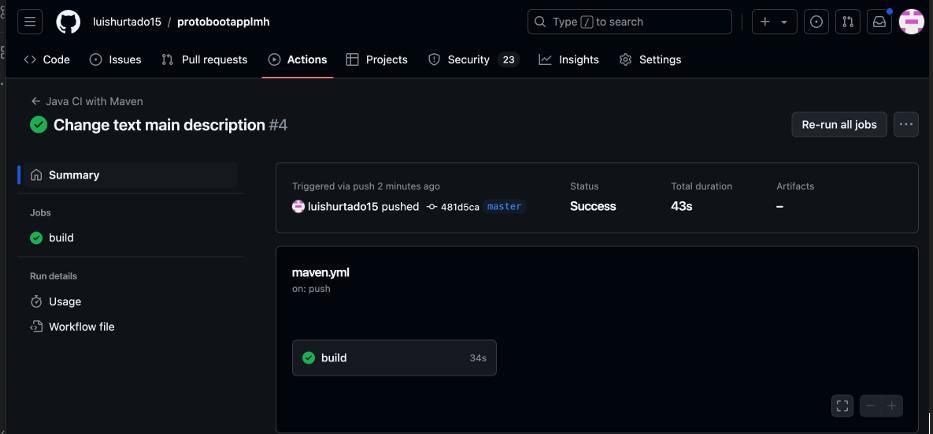
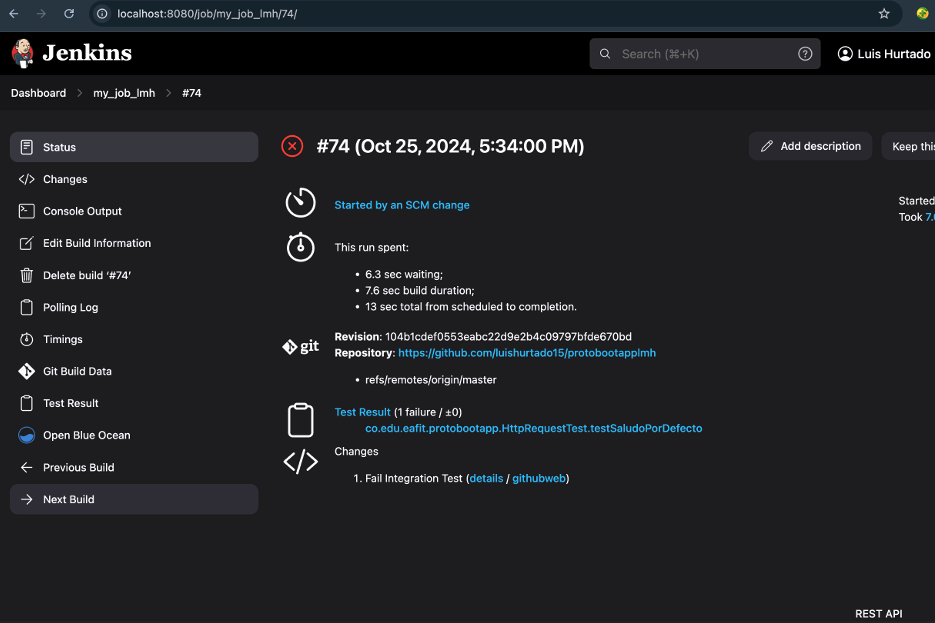

# protobootapplmh

# Taller de CI/CD

# Luis Miguel Hurtado Cova

## •	La URL del repositorio donde se guarda el código de la Proof of Concept (PoC).

https://github.com/luishurtado15/protobootapplmh/tree/master

## •	Las URLs de los entornos donde se despliega la Proof of Concept (PoC).

### DEV

http://protoboardapplmh-env.eba-tpfcjbpj.us-east-1.elasticbeanstalk.com/

### PDN

http://protoboardapplmh-prod.eba-tpfcjbpj.us-east-1.elasticbeanstalk.com/

## •	Capturas de pantalla de los entornos de montaje de los pipelines donde se vea claramente la identificación de la cuenta de usuario y/o del entorno de CI, las fases y demás datos que se consideren relevantes de los pipelines o procesos implementados.

## 1.	CI CON GITHUB ACTIONS

•	Repositorio git:

https://github.com/luishurtado15/protobootapplmh

•	Proyecto descargado en local utilizando el IDE Intellij

•	Archivo maven.yml

•	Pruebas en CI/CD

•	Exitoso

•	Fallar pruebas unitarias

•	Fallar pruebas de integración

•	Cambiar parámetros en el checkstyle

•	Cambiar el threshold (COVEREDRATIO) de JaCoCo.

## 2.	CI CON JENKINS
      
•	Exitoso

•	Fallar pruebas unitarias

•	Fallar pruebas de integración

•	Cambiar el threshold (COVEREDRATIO) de JaCoCo

•	Cambiar parametro del checkstyle

•	Visualizar con Blue Ocen

## 3.	CI/CD con AWS
 •	Despliegue con el pipeline exitoso

•	Fallo de pruebas unitarias

•	Fallo de pruebas de integración

•	Cambiar parametró de Jacoco

•	Cambiar Parametro del CheckStyle

•	URL actuator/info

•	URL actuator/health

•	URL actuactor/metrics

•	URL actuator/beans

Cloudwatch

•	Logs de codebuild

•	Métricas de servicios

•	Reportes de CodeBuild
Test Unit

Jacoco Report

# MUCHAS GRACIAS

# INTEGRACIÓN Y ENTREGA CONTINUA DE SOFTWARE
# EAFIT - 2024
